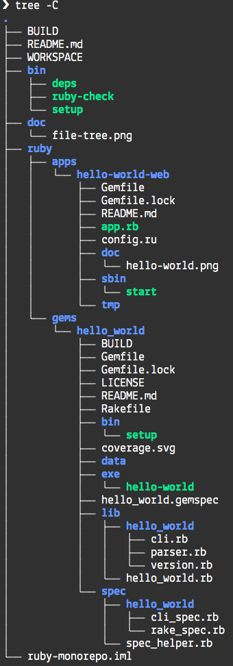

[](https://circleci.com/gh/bazelruby/ruby-monorepo)

# Mini Mono-Repo with Sample Ruby Projects built by Bazel

This is a work in progress, which attempts to bridge the world of Ruby gems and applications with the Bazel Build System.

## Pre-requisites

Install [Bazel](https://docs.bazel.build/versions/master/install-os-x.html#install-with-installer-mac-os-x) using a binary installer if you prefer, or using Homebrew: `brew install bazel`.

Then run provided setup script:

```bash
bin/setup
```

## Usage

The repo currently contains a working Gem called `hello_world` which provides a CLI that outputs Hello World! in 74 languages. If you were to use this gem without Bazel, you'd likely do something like this:

```bash
cd ruby/gems/hello_world
bundle install
bundle exec rake install
```

You could then run the executable like so:

```bash
hello_world russian
#=> Russian — Привет мир!
hello-world japanese
Japanese — こんにちは世界！
```

### Using Bazel

You can also build and run these commands using Bazel:

```bash
❯ bazel query //...:all
//ruby/gems/hello_world:specs
//ruby/gems/hello_world:cli
//ruby/gems/hello_world:hello-world-lib
Loading: 1 packages loaded
```

You can build all targets with:

```bash
bazel build //...:all  # shows targets available
#....  lots of output is skipped
```

Finally, you could run the same CLI using Bazel:

```
❯ bazel run //ruby/gems/hello_world:cli russian
INFO: Analyzed target //ruby/gems/hello_world:cli (0 packages loaded, 0 targets configured).
INFO: Found 1 target...
Target //ruby/gems/hello_world:cli up-to-date:
  bazel-bin/ruby/gems/hello_world/cli
INFO: Elapsed time: 0.175s, Critical Path: 0.00s
INFO: 0 processes.
INFO: Build completed successfully, 1 total action
INFO: Build completed successfully, 1 total action
Russian — Привет мир!
```

## Directory Structure

Below you will find the following folders — note, that the exact directory structure for monorepos is still work in progress.:



## Feedback and Contributions

To be continued.