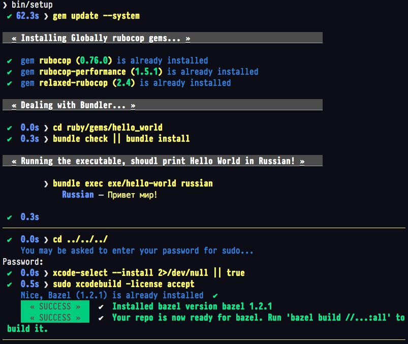
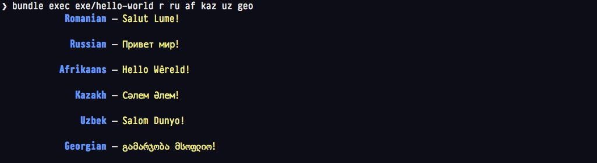
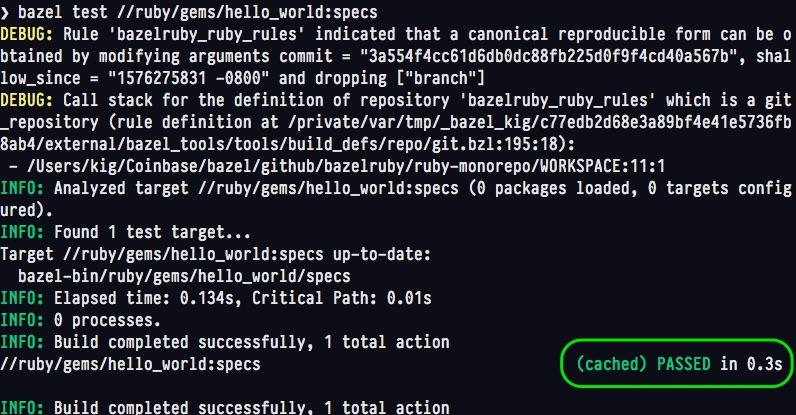
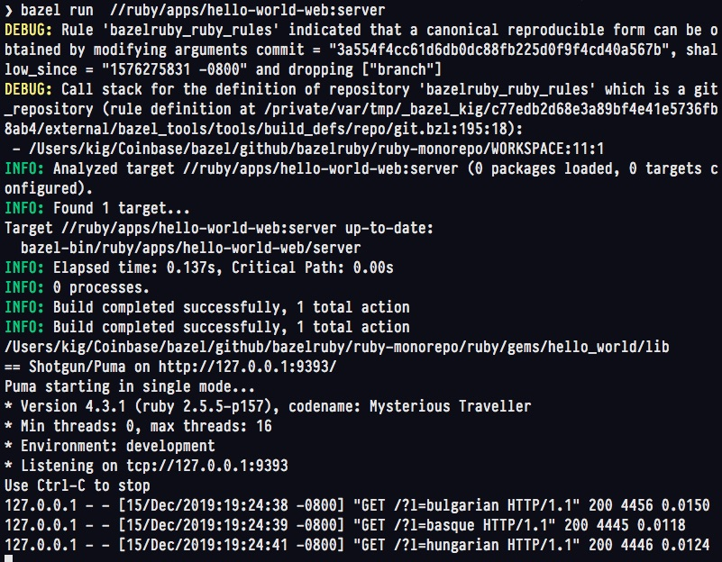

[](https://circleci.com/gh/bazelruby/ruby-monorepo)

* [Setting up Bazel](#setting-up-bazel)
* [Usage](#usage)
  * [Repo Components](#repo-components)
    * [Bazel Workspace](#bazel-workspace)
    * [Ruby Gem hello_world](#ruby-gem-hello_world)
    * [Ruby Sinatra Web App that uses hello_world gem](#ruby-sinatra-web-app-that-uses-hello_world-gem)
    * [AWS Lambda](#aws-lambda)
  * [Bazel Tooling](#bazel-tooling)
    * [1. Finding Available Targets](#1-finding-available-targets)
    * [2. Running CLI via Bazel](#2-running-cli-via-bazel)
    * [3. Running Gem Specs via Bazel](#3-running-gem-specs-via-bazel)
    * [4. Running Sinatra Web Server via Bazel](#4-running-sinatra-web-server-via-bazel)
* [Directory Structure](#directory-structure)
* [Feedback and Contributions](#feedback-and-contributions)
* [Copyright](#copyright)

# Mission Statement

**The goal of this BazelRuby integration project is to make Ruby a first-class citizen in the Bazel eco-system, to be able to support very large Ruby mono-repo, and to take advantage of the parallel builds and fast caching that Bazel is famous for.**


# A Working Example of a Ruby Mono-Repo

> NOTE: This is still work in progress, which attempts to bridge the world of Ruby gems and applications with the Bazel Build System.

> NOTE: This project has been developed and tested on Mac OS-X. If you are on Windows, your mileage may vary.

## Setting up Bazel

Install [Bazel](https://docs.bazel.build/versions/master/install-os-x.html#install-with-installer-mac-os-x) using a binary installer if you prefer, or using Homebrew: `brew install bazel`.

Then run the provided setup script:

```bash
bin/setup
```

You should see something like this:



## Usage

Since the expected audience of this README are relatively experienced Ruby Programmers, we will focus on the
Bazel integration portion of this, and show how to run commands via Bazel.

### Repo Components

As the goal of this "fake" mono-repo is to be an example on which other Ruby Projects can be combined into a singular tree, we tried including various permutations of the Ruby libraries and applications, with inter-dependencies, external dependencies, and so on.

> NOTE: At the moment this Repo does NOT include a Ruby on Rails application, but that's coming soon.

It helps to start with the description of what is going on here:

#### Bazel Workspace

This repo is a **Bazel Workspace**. It has a single `WORKSPACE` file at the top level, which, among other things, loads [`rules_ruby` project](https://github.com/bazelruby/rules_ruby) as a third party dependency.

All pure ruby code is under the `ruby` folder.

#### Ruby Gem `hello_world`

Under `ruby/gems/hello_world` you would find a very simple Ruby Gem with a singular dependency on a gem called `colored2`. The gem's claim to fame is its ability to say "Hello World" in 74 languages. Powerful, right?

 * The Gem provides both Ruby SDK and the command line utility that can be called with a language-substring as a parameter.

 * You can test is as follows:

```bash
cd ruby/gems/hello_world
bundle install
# arguments are full or partial languages
bundle exec exe/hello-worldr ru af kaz uz geo
```

You might see something like the following output:



#### Ruby Sinatra Web App that uses `hello_world` gem

Under `ruby/apps/hello-world-web` you will find a simple Sinatra app that uses the `hello_world` gem, not via the Gemfile, but via direct relative path inclusion.

To test it without Bazel:

```bash
cd ruby/apps/hello-world-web
bundle install
bin/start
# .../ruby-monorepo/ruby/gems/hello_world/lib
# == Shotgun/Puma on http://127.0.0.1:9393/
# Puma starting in single mode...
# * Version 4.3.1 (ruby 2.5.5-p157), codename: Mysterious Traveller
# * Min threads: 0, max threads: 16
# * Environment: development
# * Listening on tcp://127.0.0.1:9393
# Use Ctrl-C to stop
```

If you click on [http://127.0.0.1:9393/](http://127.0.0.1:9393/) URL shown above, you should see a minimalistic user interface:


#### AWS Lambda

This folder is still under construction, so more info to come.

This completes our overview of included components.

### Bazel Tooling

This mono-repo depends on the [rules_ruby](https://github.com/bazelruby/rules_ruby) repository (`develop` branch).

Next examples we'll run from the top level folder of the project, but that's technically not necessary.

#### 1. Finding Available Targets

```bash
bazel query //...:all
#//ruby/gems/hello_world:specs
#//ruby/gems/hello_world:cli
#//ruby/apps/hello-world-web:server
#//ruby/gems/hello_world:lib
# Loading: 1 packages loaded
```

You can build all targets with:

```bash
bazel build //...:all  # shows targets available
#....  lots of output is skipped
```

As part of the output, you should see the result of two `bundle install` automatically called by Bazel Tooling.

#### 2. Running CLI via Bazel

Finally, you could run the same CLI using Bazel:

```bash
bazel run //ruby/gems/hello_world:cli russian
# INFO: Analyzed target //ruby/gems/hello_world:cli (0 packages loaded, 0 targets configured).
# INFO: Found 1 target...
# Target //ruby/gems/hello_world:cli up-to-date:
#   bazel-bin/ruby/gems/hello_world/cli
# INFO: Elapsed time: 0.175s, Critical Path: 0.00s
# INFO: 0 processes.
# INFO: Build completed successfully, 1 total action
# INFO: Build completed successfully, 1 total action
Russian — Привет мир!
```

#### 3. Running Gem Specs via Bazel

As one of the targets is `hello_world:specs` you can run it like so:

```bash
bazel test //ruby/gems/hello_world:specs
```

It's best to show the results of running specs in a screenshot:




#### 4. Running Sinatra Web Server via Bazel

This is, perhaps, the most complicated Bazel task in this repo to date. This is because it depends on it's own Bundle (and gems such as Puma), but it also depends on the internal library `hello_world`.

Here is the screenshot of running the server on the foreground, and hitting it a few times with requests:



---

## Directory Structure

Finally, below is the result of the `tree -C` command showing how the files are layed out int his repo.


## Feedback and Contributions

Please read and follow our [Code of Conduct](CODE_OF_CONDUCT.md), and we are very happy to accept help and pull requests or issues, or whatever you can contribute.

## Copyright

© 2019-2020 Konstantin Gredeskoul, Coinbase, & BazelRuby Authors

Licensed under the [Apache License](LICENSE), Version 2.0 (the "License"); you may not use this file except in compliance with the License. You may obtain a copy of the License at

<http://www.apache.org/licenses/LICENSE-2.0>

Unless required by applicable law or agreed to in writing, software distributed under the License is distributed on an "AS IS" BASIS, WITHOUT WARRANTIES OR CONDITIONS OF ANY KIND, either express or implied. See the License for the specific language governing permissions and limitations under the License.